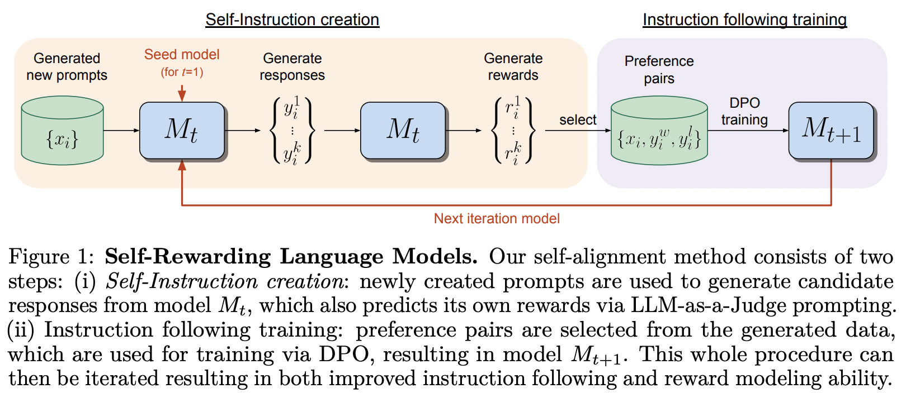

</img>

## Self-Rewarding Language Model

Implementation of the training framework proposed in <a href="https://arxiv.org/abs/2401.10020">Self-Rewarding Language Model</a>, from MetaAI

They really took the <a href="https://arxiv.org/abs/2305.18290">title of the DPO paper</a> to heart.

This library also contains an implementation of <a href="https://arxiv.org/abs/2401.01335v1">SPIN</a>, which <a href="https://github.com/teknium1">Teknium</a> of <a href="https://twitter.com/nousresearch">Nous Research</a> has expressed optimism for.

## Appreciation

- <a href="https://a16z.com/supporting-the-open-source-ai-community/">A16Z Open Source AI Grant Program</a> and <a href="https://huggingface.co/">🤗 Huggingface</a> for the generous sponsorships, as well as my other sponsors, for affording me the independence to open source current artificial intelligence research

## Install

``` bash
$ pip install self-rewarding-lm-pytorch
```

## Usage

```python
import torch
from torch import Tensor

from self_rewarding_lm_pytorch import (
    SelfRewardingTrainer,
    create_mock_dataset
)

from x_transformers import TransformerWrapper, Decoder

transformer = TransformerWrapper(
    num_tokens = 256,
    max_seq_len = 1024,
    attn_layers = Decoder(
        dim = 512,
        depth = 1,
        heads = 8
    )
)

sft_dataset = create_mock_dataset(100, lambda: (torch.randint(0, 256, (256,)), torch.tensor(1)))
prompt_dataset = create_mock_dataset(100, lambda: 'mock prompt')

def decode_tokens(tokens: Tensor) -> str:
    decode_token = lambda token: str(chr(max(32, token)))
    return ''.join(list(map(decode_token, tokens)))

def encode_str(seq_str: str) -> Tensor:
    return Tensor(list(map(ord, seq_str)))

trainer = SelfRewardingTrainer(
    transformer,
    finetune_configs = dict(
        train_sft_dataset = sft_dataset,
        self_reward_prompt_dataset = prompt_dataset,
        dpo_num_train_steps = 1000
    ),
    tokenizer_decode = decode_tokens,
    tokenizer_encode = encode_str,
    accelerate_kwargs = dict(
        cpu = True
    )
)

trainer(overwrite_checkpoints = True)

# checkpoints after each finetuning stage will be saved to ./checkpoints
```

SPIN can be trained as follows - it can also be added to the fine-tuning pipeline as shown in the final example in the readme.

```python
import torch

from self_rewarding_lm_pytorch import (
    SPINTrainer,
    create_mock_dataset
)

from x_transformers import TransformerWrapper, Decoder

transformer = TransformerWrapper(
    num_tokens = 256,
    max_seq_len = 1024,
    attn_layers = Decoder(
        dim = 512,
        depth = 6,
        heads = 8
    )
)

sft_dataset = create_mock_dataset(100, lambda: (torch.randint(0, 256, (256,)), torch.tensor(1)))

spin_trainer = SPINTrainer(
    transformer,
    max_seq_len = 16,
    train_sft_dataset = sft_dataset,
    checkpoint_every = 100,
    spin_kwargs = dict(
        λ = 0.1,
    ),
)

spin_trainer()
```

Say you want to experiment with your own reward prompt (other than LLM-as-Judge). First you need to import the `RewardConfig`, next pass it into the trainer as `reward_prompt_config`

```python

# first import

from self_rewarding_lm_pytorch import RewardConfig

# then say you want to try asking the transformer nicely

# reward_regex_template is the string that will be looked for in the LLM response, for parsing out the reward where {{ reward }} is defined as a number

trainer = SelfRewardingTrainer(
    transformer,
    ...,
    self_reward_prompt_config = RewardConfig(
        prompt_template = """
        Pretty please rate the following user prompt and response
        User: {{ prompt }}
        Response: {{ response }}

        Format your score as follows:
        Rating: <rating as integer from 0 - 10>
        """,
        reward_regex_template = """
        Rating: {{ reward }}
        """
    )
)
```

Finally, if you would like to experiment with arbitrary orders of fine-tuning, you will also have that flexiblity, by passing in `FinetuneConfig` instances into `finetune_configs` as a list

ex. say you want to carry out research on interleaving SPIN, External Rewarding, and Self-Rewarding

This idea originated from <a href="https://github.com/teknium1">Teknium</a> from a private discord channel.

```python

# import the configs

from self_rewarding_lm_pytorch import (
    SFTConfig,
    SelfRewardDPOConfig,
    ExternalRewardDPOConfig,
    SelfPlayConfig,
)

trainer = SelfRewardingTrainer(
    model,
    finetune_configs = [
        SFTConfig(...),
        SelfPlayConfig(...),
        ExternalRewardDPOConfig(...),
        SelfRewardDPOConfig(...),
        SelfPlayConfig(...),
        SelfRewardDPOConfig(...)
    ],
    ...
)

trainer()

# checkpoints after each finetuning stage will be saved to ./checkpoints
```

## Todo

- [x] generalize the sampling so that it can progress at different positions in the batch, fix all sampling to be batched. also allow for left padded sequences, in the case some people have transformers with relative positions that allow for that
- [x] handle eos
- [x] show an example for using your own reward prompt instead of default llm-as-judge
- [x] allow for different strategies for sampling the pairs
- [x] early stopper
    - [x] handle break signal if all done on main process
    - [x] accept eval module, could be either validation loss or something more sophisticated. returns a scalar tensor or single int / float
- [x] any order of sft, spin, self-rewarding dpo, dpo with external reward model
- [x] allow for a validation function on the rewards (say reward must be integer, float, in between some range etc)

- [ ] figure out how best to handle different impl of kv cache, for now just do without
- [ ] environment flag that auto-clears all checkpoint folders

## Citation

```bibtex
@misc{yuan2024selfrewarding,
    title   = {Self-Rewarding Language Models}, 
    author  = {Weizhe Yuan and Richard Yuanzhe Pang and Kyunghyun Cho and Sainbayar Sukhbaatar and Jing Xu and Jason Weston},
    year    = {2024},
    eprint  = {2401.10020},
    archivePrefix = {arXiv},
    primaryClass = {cs.CL}
}
```

```bibtex
@article{Chen2024SelfPlayFC,
    title   = {Self-Play Fine-Tuning Converts Weak Language Models to Strong Language Models},
    author  = {Zixiang Chen and Yihe Deng and Huizhuo Yuan and Kaixuan Ji and Quanquan Gu},
    journal = {ArXiv},
    year    = {2024},
    volume  = {abs/2401.01335},
    url     = {https://api.semanticscholar.org/CorpusID:266725672}
}
```

```bibtex
@article{Rafailov2023DirectPO,
    title   = {Direct Preference Optimization: Your Language Model is Secretly a Reward Model},
    author  = {Rafael Rafailov and Archit Sharma and Eric Mitchell and Stefano Ermon and Christopher D. Manning and Chelsea Finn},
    journal = {ArXiv},
    year    = {2023},
    volume  = {abs/2305.18290},
    url     = {https://api.semanticscholar.org/CorpusID:258959321}
}
```

```bibtex
@inproceedings{Guo2024DirectLM,
    title   = {Direct Language Model Alignment from Online AI Feedback},
    author  = {Shangmin Guo and Biao Zhang and Tianlin Liu and Tianqi Liu and Misha Khalman and Felipe Llinares and Alexandre Rame and Thomas Mesnard and Yao Zhao and Bilal Piot and Johan Ferret and Mathieu Blondel},
    year    = {2024},
    url     = {https://api.semanticscholar.org/CorpusID:267522951}
}
```

